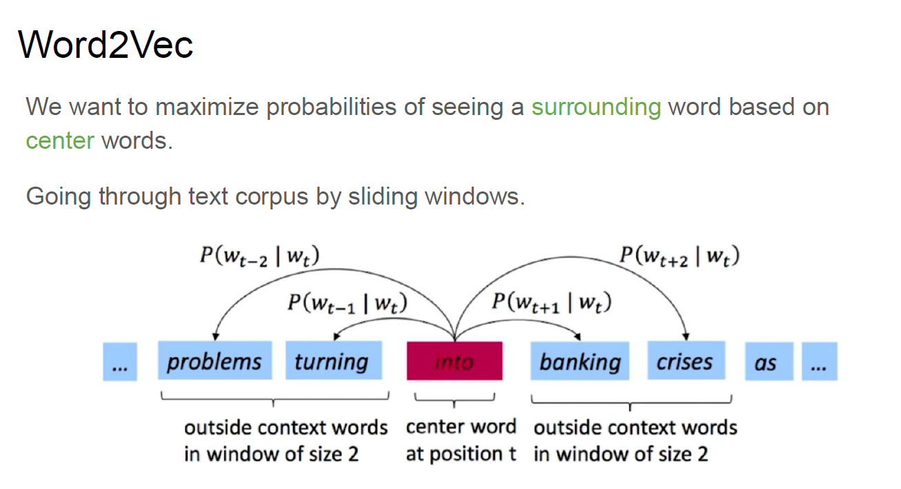
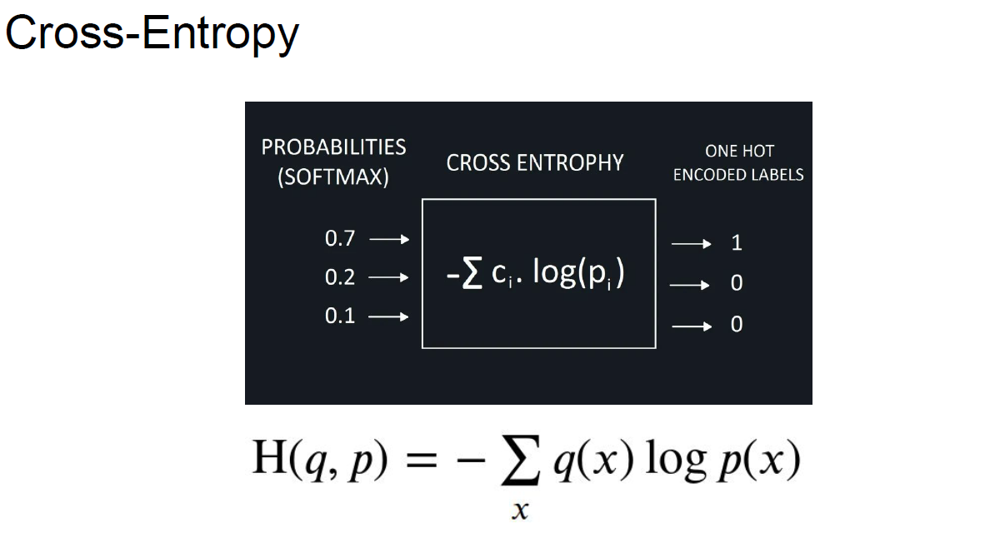
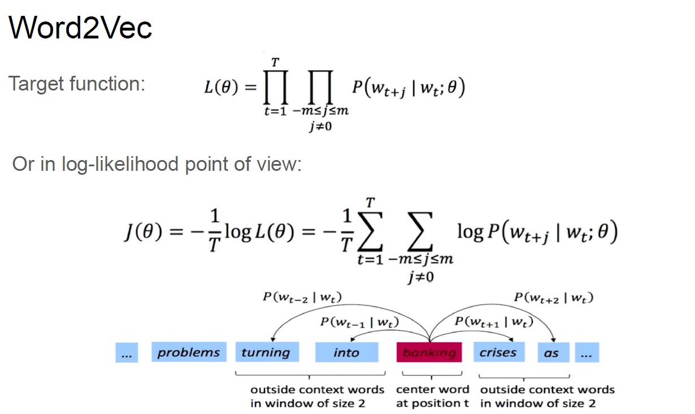
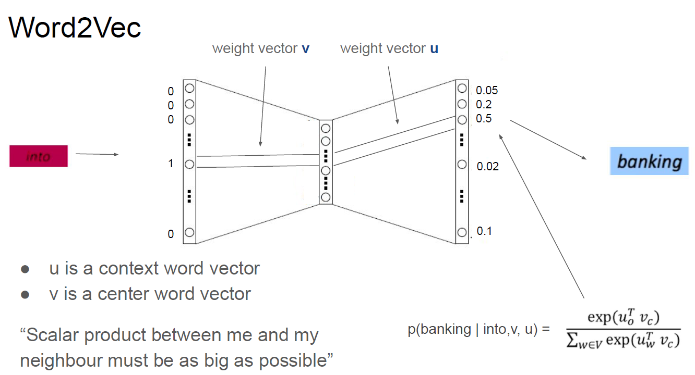
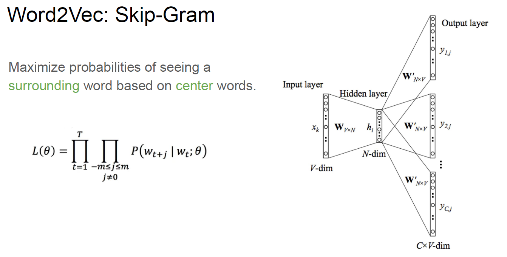
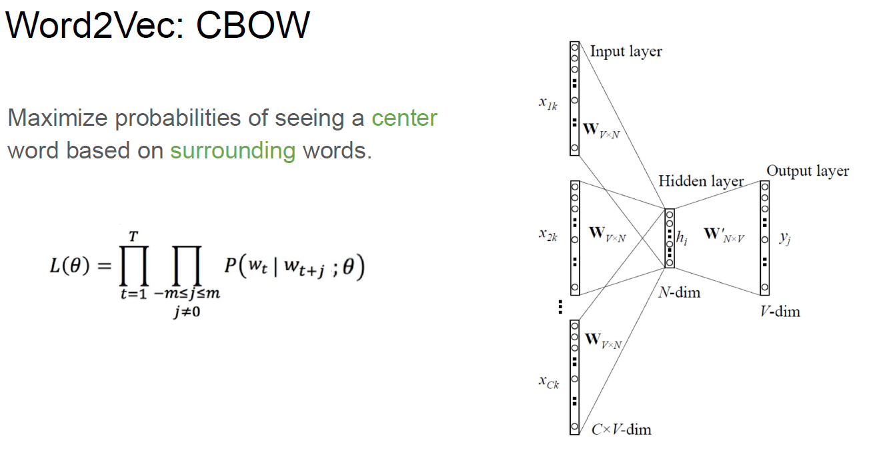
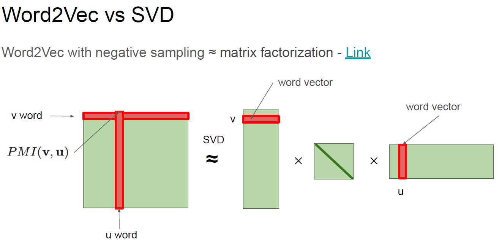
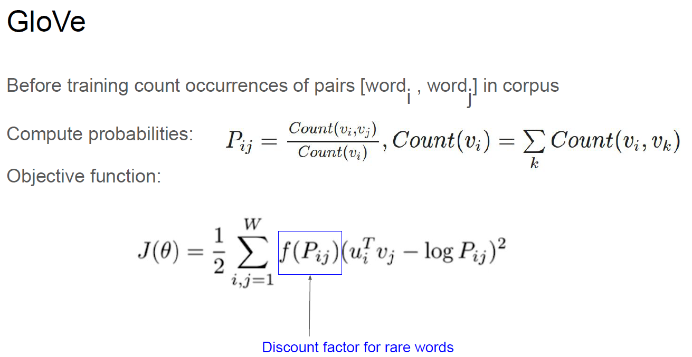

## Embeddings

- [Embeddings.pdf](Embeddings.pdf)
- [word2vec.ipynb](word2vec.ipynb)

- [Лекция. Embeddings.](https://www.youtube.com/watch?v=eXQAOTsbhLQ)
- [Семинар. Word2Vec.](https://www.youtube.com/watch?v=iLzZO_4xyMg)

- Word2Vec(идея скользящего окна для подсчёта pmi, Co-Occurrence Count, etc.)
  
- Cross-Entropy(мера расхождения между двумя распределениями)
  
- Target function, log-likelihood для Word2Vec
  
- Схема работы Word2Vec
  
- 2 схемы работы Word2Vec(Skip-Gram, CBOW)
  
  
- Word2Vec + negative sampling ~ SVD
  
- Видоизменённая лосс-функция
  