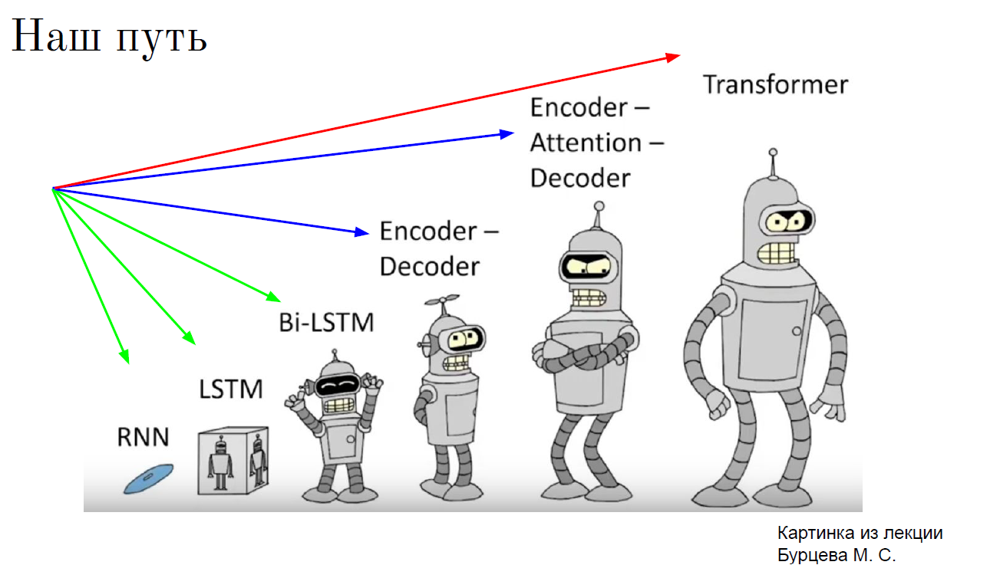
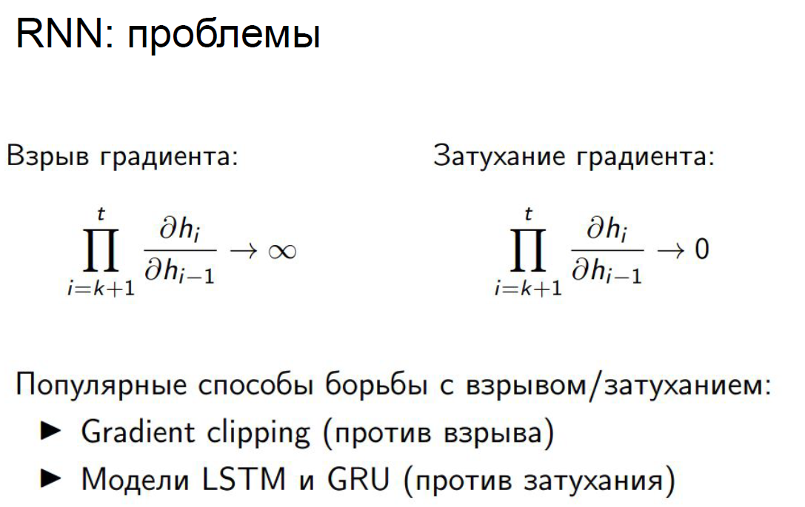
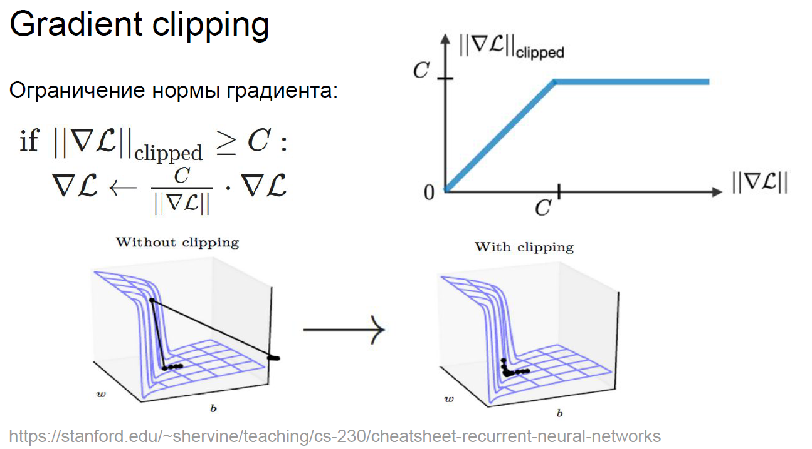
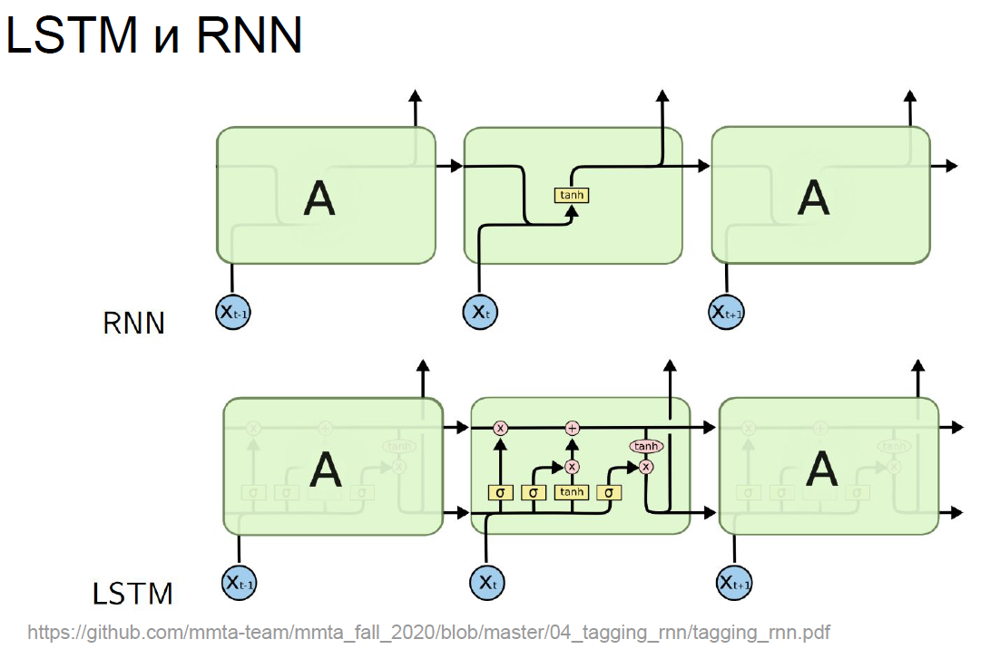
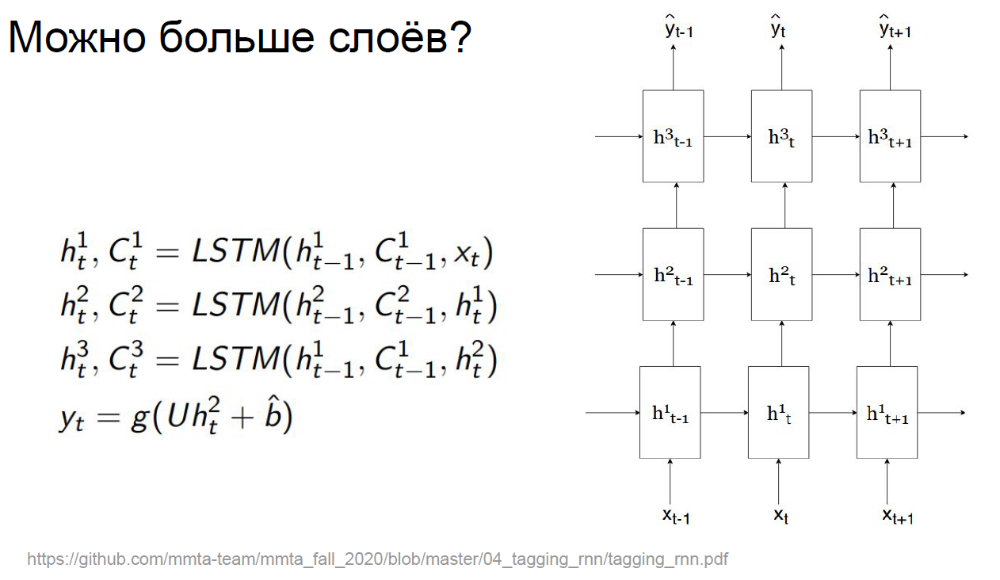
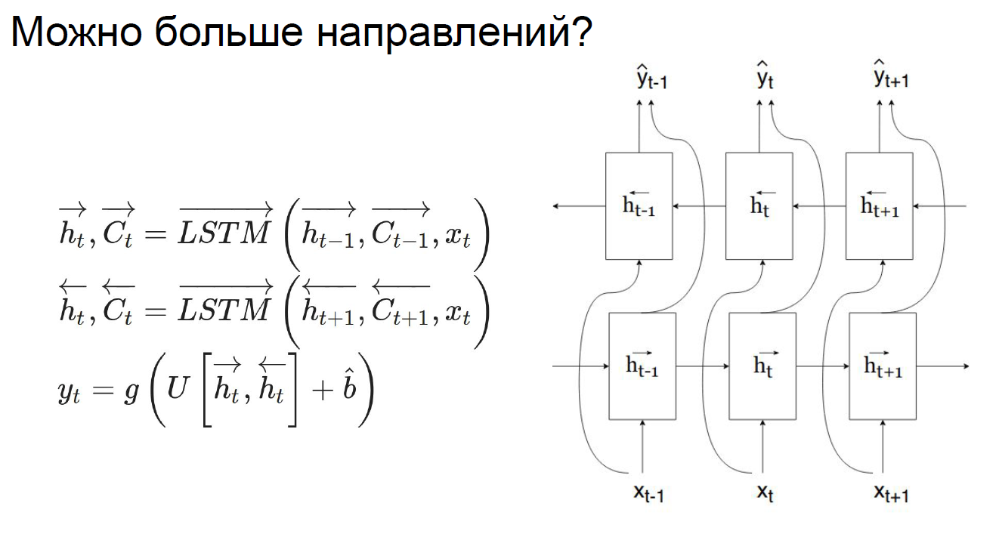
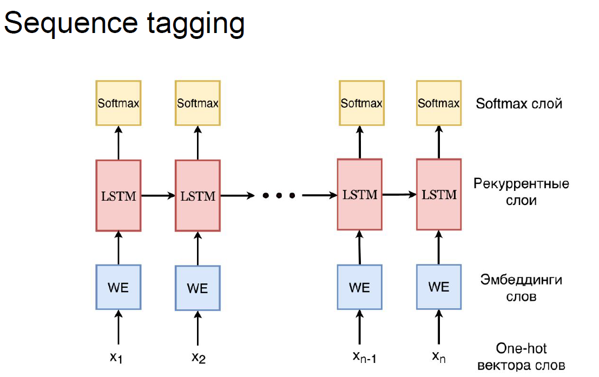
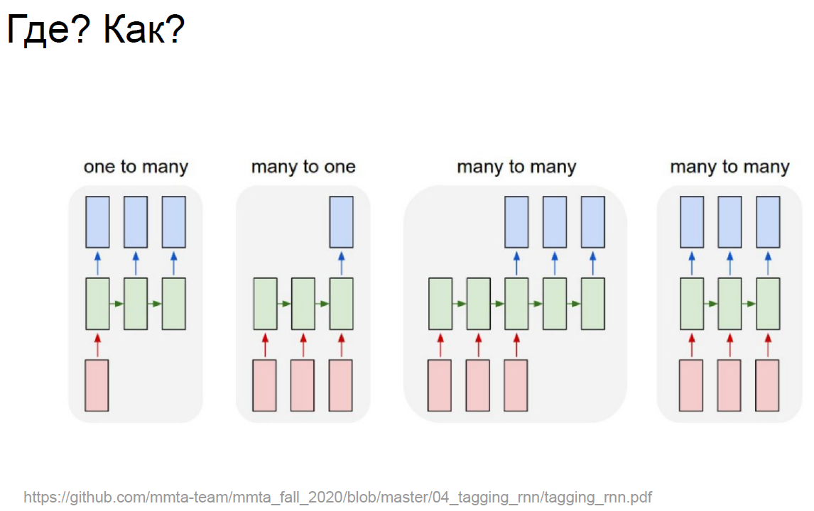

## Рекуррентные нейронные сети

- [RNN.pdf](RNN.pdf)
- [seminar_cnn_and_rnn.ipynb](seminar_cnn_and_rnn.ipynb)
    - [библиотека Datasets от huggingface](https://huggingface.co/docs/datasets/)

- [Лекция. Embeddings.](https://www.youtube.com/watch?v=eXQAOTsbhLQ&ab_channel=DeepLearningSchool)
- [Семинар. Рекуррентные нейронные сети](https://www.youtube.com/watch?v=_wpAkWZmlyg&t=1474s&ab_channel=DeepLearningSchool)

- Более сложные структуры для рекуррентных нейронных сетей
  
  
  
  