## Language modelling

- [Языковые_модели.pdf](Языковые_модели.pdf)
- [Language_modeling_seminar.ipynb](Language_modeling_seminar.ipynb)

- [Лекция. Языковые модели. Введение. Частотный подход](https://www.youtube.com/watch?v=aS2A7b-4uT4&list=PL0Ks75aof3Ti1GDgeePUkCJWn02c0VDA5&index=10)
- [Лекция. Языковые модели. Нейронные сети](https://www.youtube.com/watch?v=-tK7WcE5Wfo&list=PL0Ks75aof3Ti1GDgeePUkCJWn02c0VDA5&index=9)
- [Семинар. Языковые модели](https://www.youtube.com/watch?v=WoYRZEsWIrg&list=PL0Ks75aof3Ti1GDgeePUkCJWn02c0VDA5&index=8&ab_channel=DeepLearningSchool)

- Что делает языковая модель(LM)?
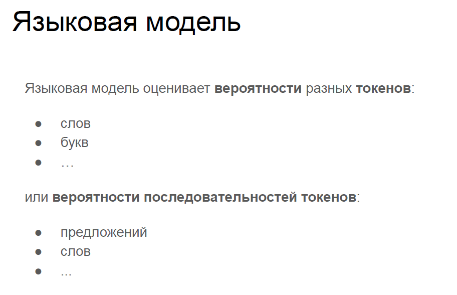
- Пример работы языковой модели(варианты продолжения поискового вопроса)
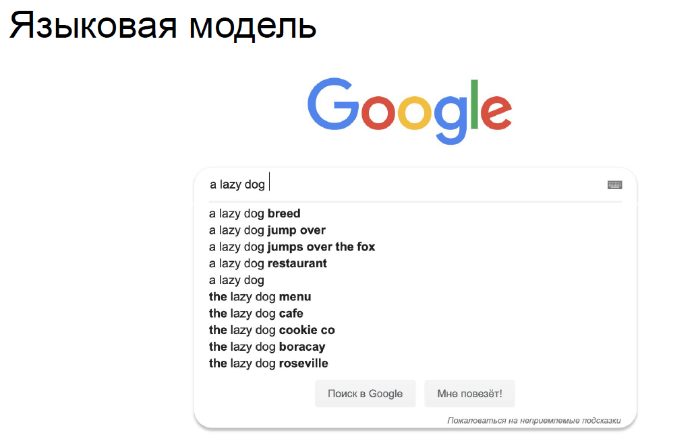
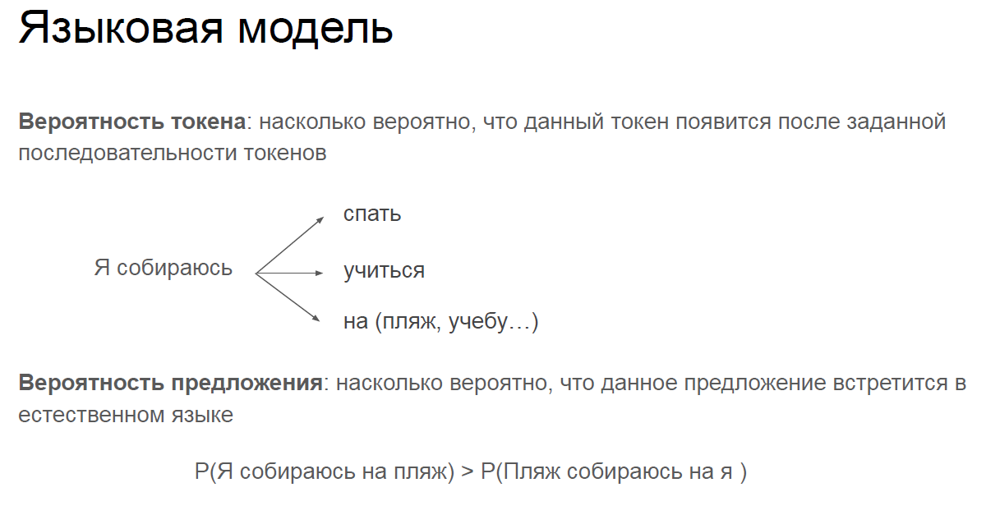
- Существует 2 типа языковых моделей
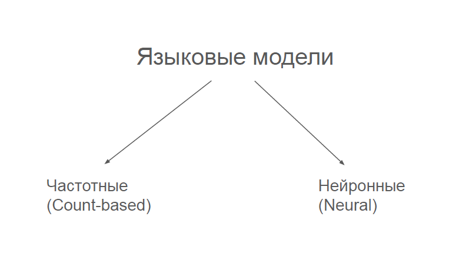
- Идея работы Count Based LM

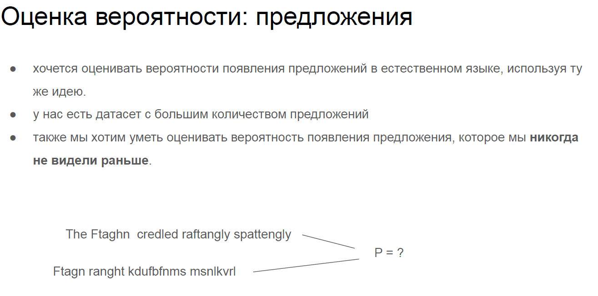
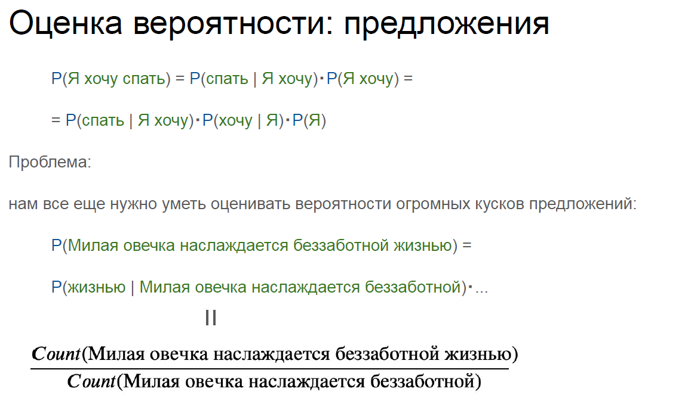
- Идея использовать не всю последоватьность слов, а лишь ближайшие n слов
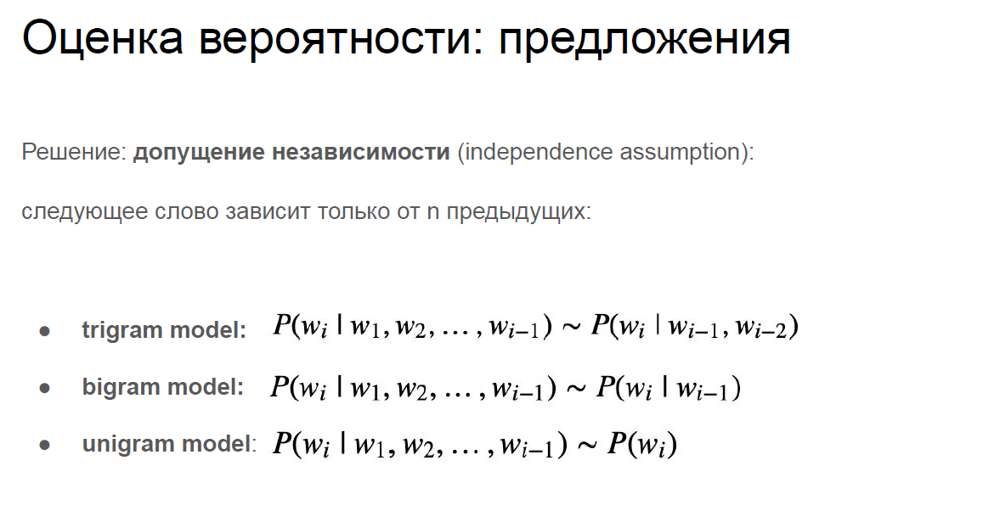
- Пример того, как строиться триграммая языковая модель
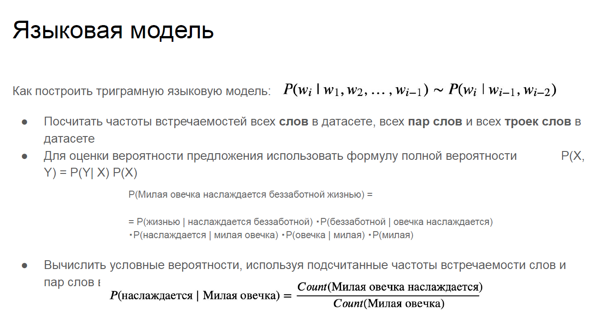
- Как языковая модель генерирует текст
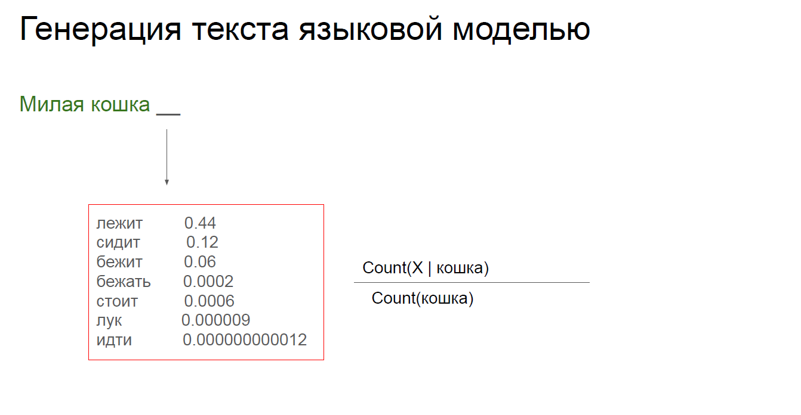
- Оценка качества языковой модели
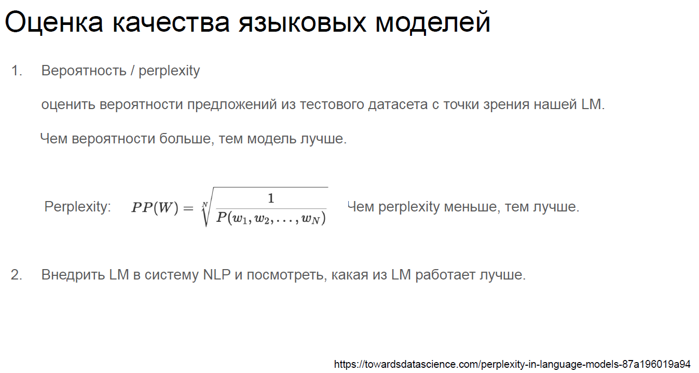
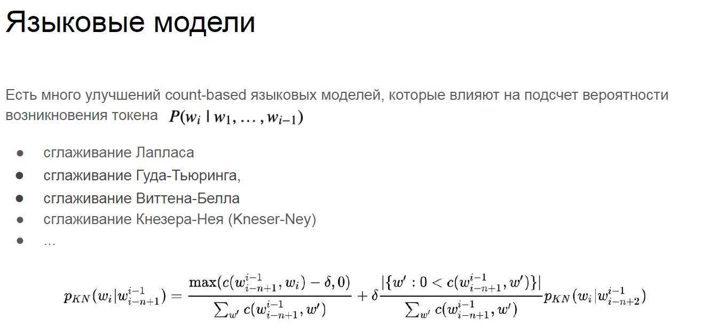
- Примерная архитектура Нейронной Языковой Модели(Neural LM)
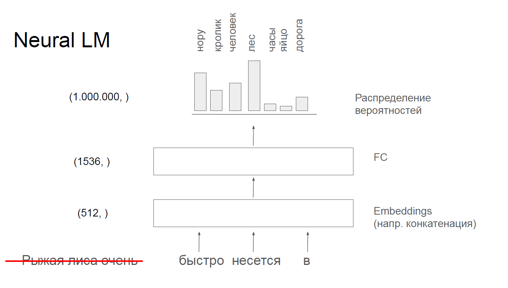
- Обучаем модель с помощью cross entropy loss
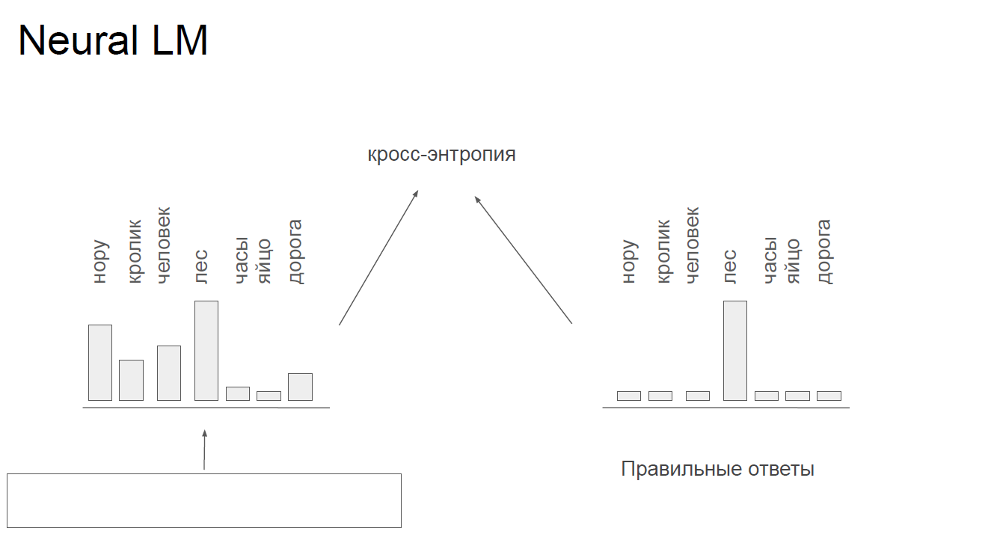
- Neural LM на основне RNN(можно использовать любое кол-во слов предложении)
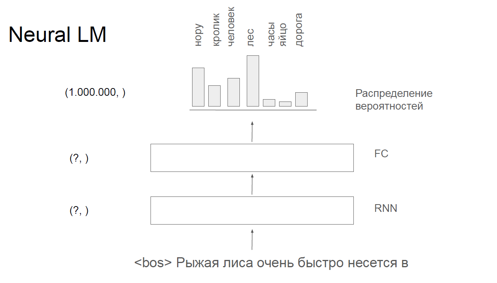
- Neural LM на основе CNN(вынуждены использовать n ближайших слов)
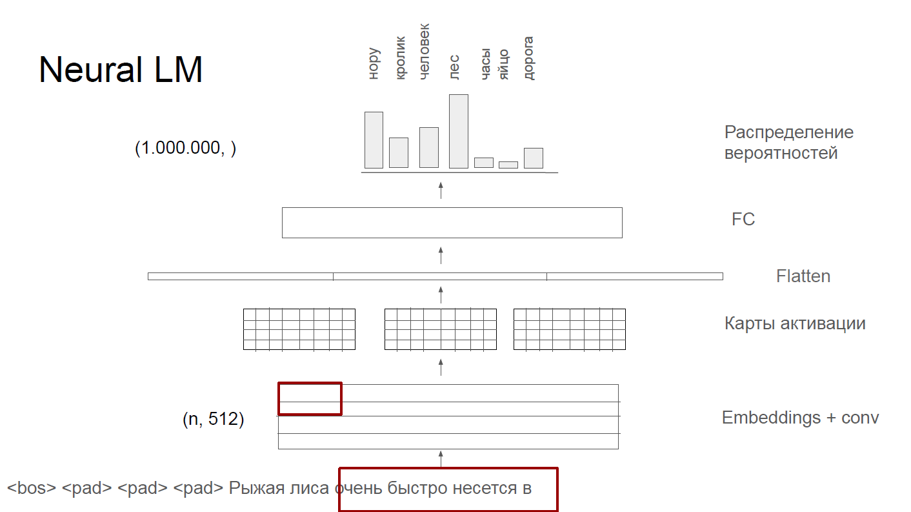
- Ещё одна архитектура Neural LM, позволяющая генерировать эмбеддинг целого предложения
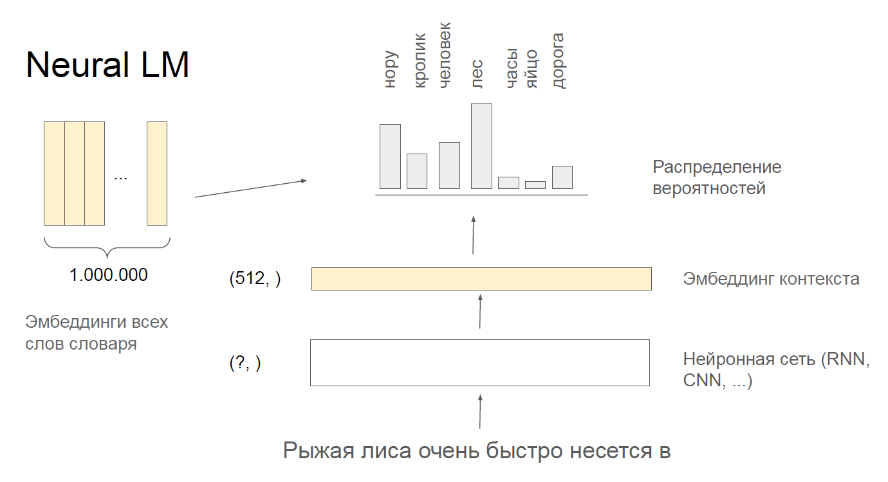
- Генерация "хороших" эмбеддингов предложений с помощью Neural LM 
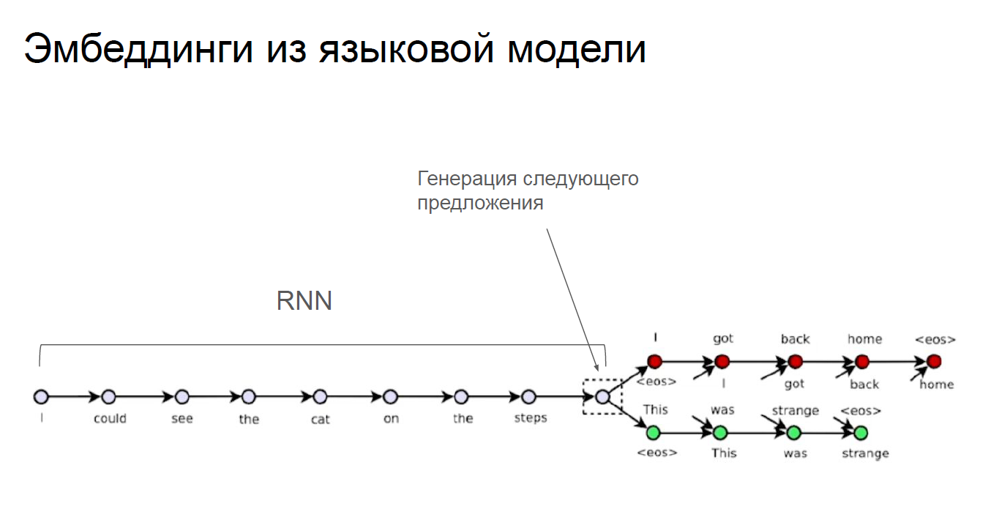