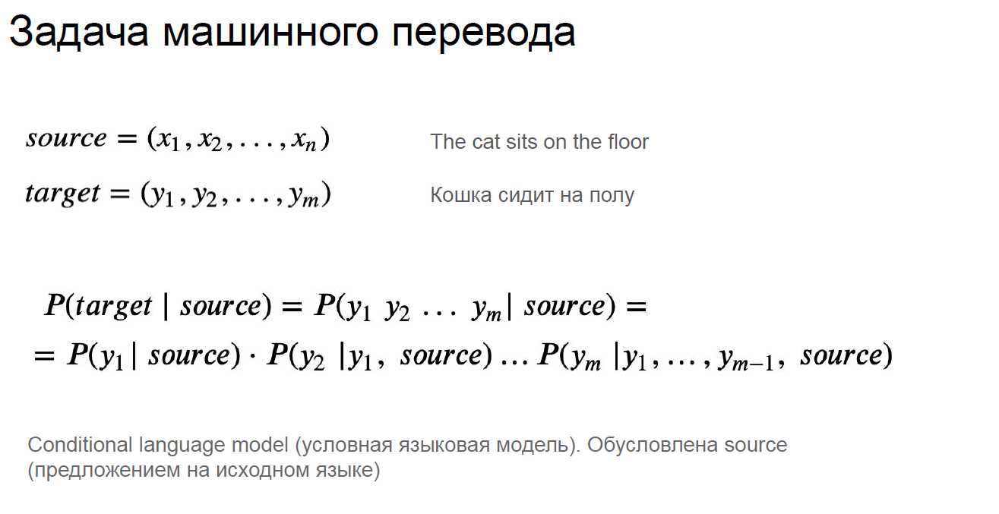

## Neural Machine Translation

- [Seq2Seq_Attention.pdf](Seq2Seq_Attention.pdf)
- [[seminar_class]NeuralMachineTranslation.ipynb]([seminar_class]NeuralMachineTranslation.ipynb)

- [Лекция. Seq2Seq, машинный перевод.](https://www.youtube.com/watch?v=N3TLYsn0TU8&ab_channel=DeepLearningSchool)
- [Лекция. Внимание (Attention)](https://www.youtube.com/watch?v=G4vT5cvJSxY&ab_channel=DeepLearningSchool)
- [Семинар. Seq2Seq](https://www.youtube.com/watch?v=d8A1nxoZDDk&ab_channel=DeepLearningSchool)

- Постановка задачи машинного перевода

- Seq2Seq(или как решать задачу машинного перевода с помощью нейронных сетей)
- Архитектура Encoder-Decoder

- Как обучается Encoder-Decoder?

- Teacher-forcing(подача decoder-у правильных слов)

- Метрика качества машинного перевода

- Проблемы архитектуры Encoder-Decoder

- Пример проблемы жадного декодировани

- Решение проблемы жадного декодирования: Beam search

- Идея Attention

- Attention для Decoder

- Примеры того, что может быть Attention

- Self-Attention

- Self-Attention для Encoder

- Self-Attention для Decoder

- В модели может быть несколько Attention, Self-Attention

