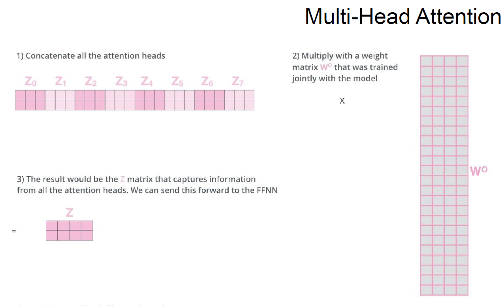

## Transformers

- [Transformers.pdf](Transformers.pdf)
- [Attention_is_All_You_Need.ipynb](Attention_is_All_You_Need.ipynb)

- [Лекция. Трансформеры. Self-Attention](https://www.youtube.com/watch?v=f544TipD2QY)
- [Лекция. Трансформеры. Positional Encoding, Decoder side, Training](https://www.youtube.com/watch?v=WL6UviEG3XA)
- [Семинар. Трансформеры](https://www.youtube.com/watch?v=KdMS5XWQAic)

- Архитектура transformers

- Более детальная архитектура transformers

- Архитектура Encoder

- Визуализация Механизма Self-Attention

- Self-Attention

- Self-Attention(через матрицы)

- Multi-Head Attention

- Конкатенация выводов Multi-head Attention

- Attention vs. Multi-Head Attention

- Positional Encoding

- Layer Normalization

- Decoder

- Training transformers

