# Deep_Learning_School_part_2
Данный репозиторий является кратким, структурированным конспектом
изучаемого материала в процессе обучения в Deep Learning School

## Оглавление

- [Организационная информация](#Организационная-информация)
- [Введение в NLP и классификация текста](#Введение-в-NLP-и-классификация-текста)

## Организационная информация

## Введение в NLP и классификация текста
 
- [Введение_в_NLP.pdf](02_Введение_в_NLP_и_классификация_текста/Введение_в_NLP.pdf)
- [[seminar]text_preprocessing_and_classification.ipynb](02_Введение_в_NLP_и_классификация_текста/[seminar]text_preprocessing_and_classification.ipynb)
    - [nltk](https://www.nltk.org/)
    - [Gensim](https://radimrehurek.com/gensim/)
    - [Razdel](https://natasha.github.io/razdel/)
    - [natasha](https://natasha.github.io/)

- [Лекция. Введение в NLP.](https://www.youtube.com/watch?v=d0oV1MZ_KdE&ab_channel=DeepLearningSchool)
- [Семинар. Обработка текста.](https://www.youtube.com/watch?v=Aa-p8ddbxpQ)
- [Семинар. Решение задачи классификации текста](https://www.youtube.com/watch?v=ltyWeIPrAVA)

- Предобработка текста
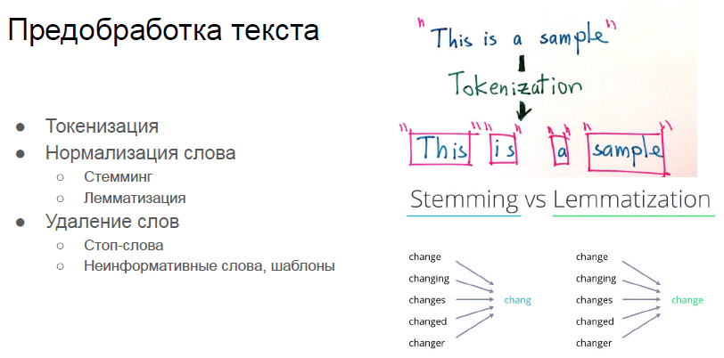
- Выделение признаков
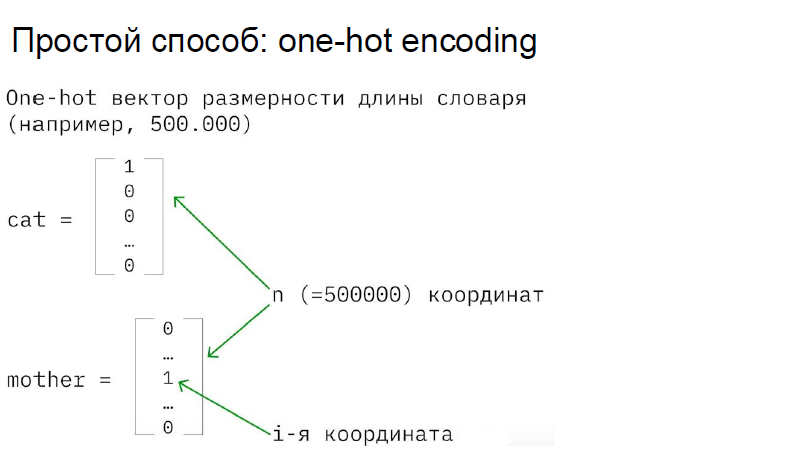
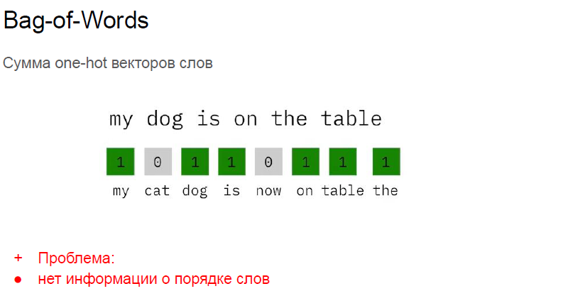
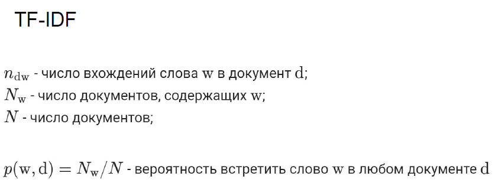
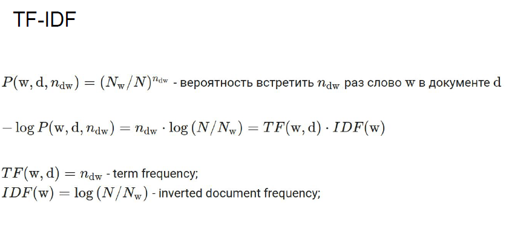
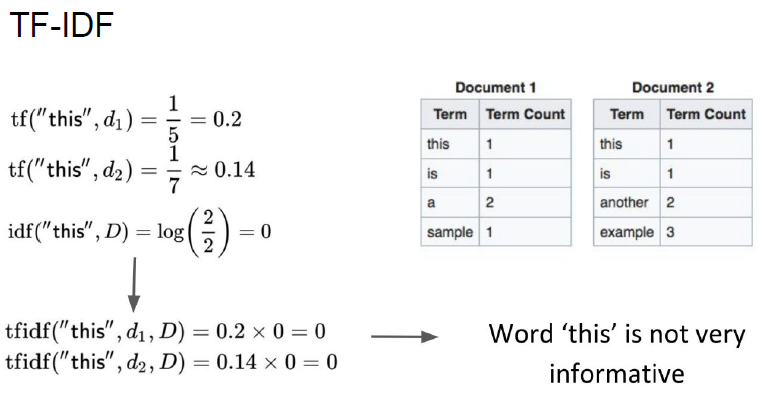
- Коллокация, NGramms
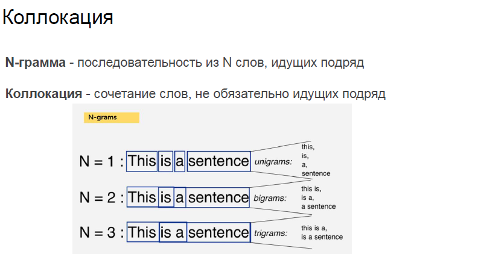
- Pointwise mutual information
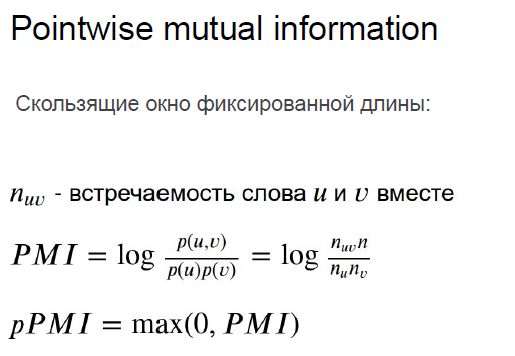
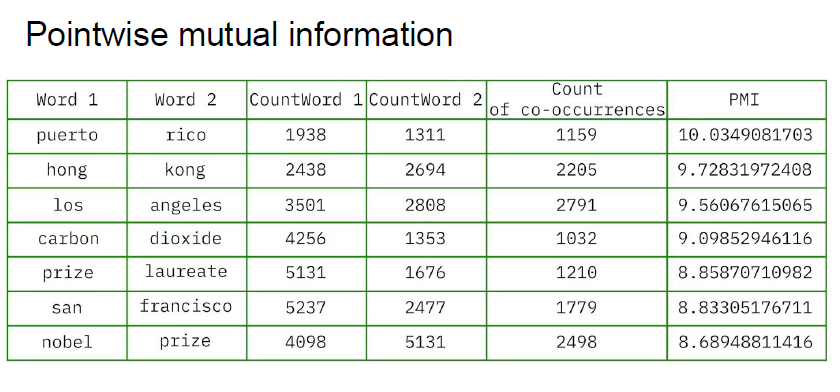
- Context embeddings
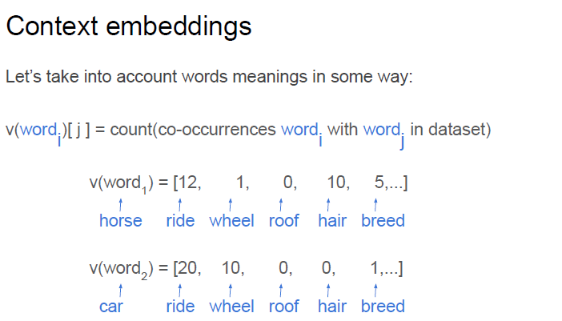
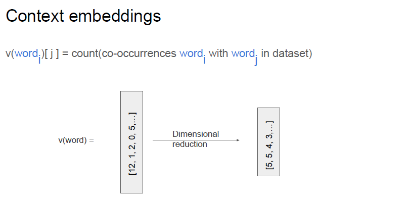
- Уменьшение размерности данных
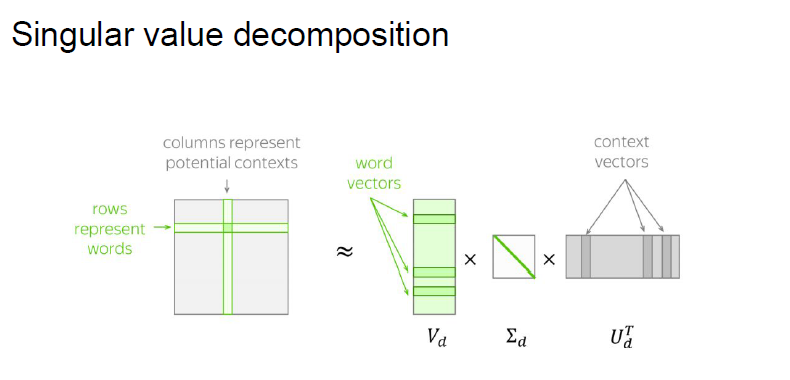
- Co-Occurrence Count + dimensional reduction
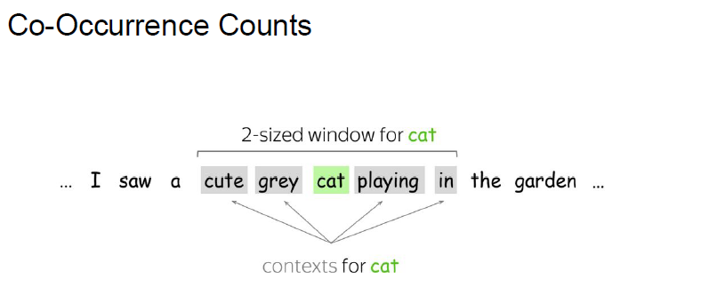
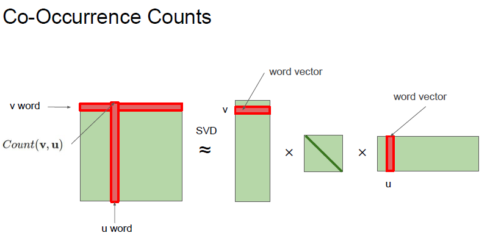
- PMI + dimensional reduction
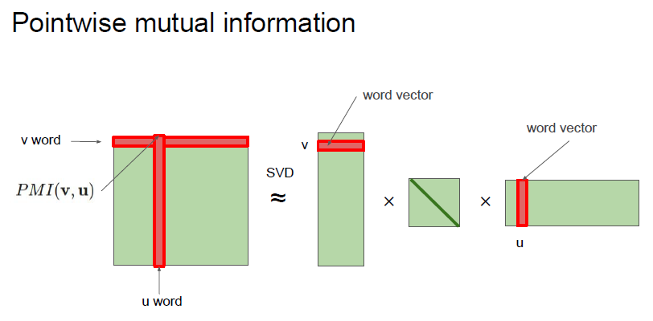
- TF-IDF + dimensional reduction
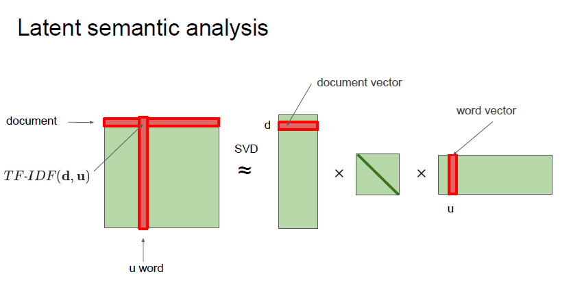

