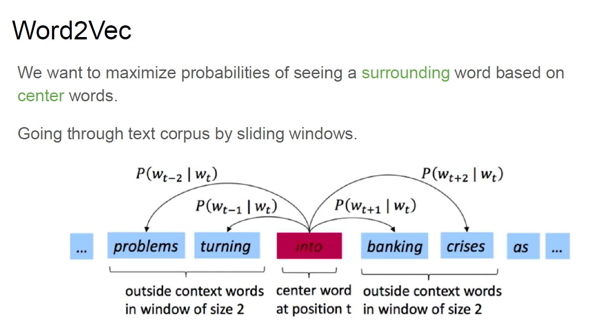
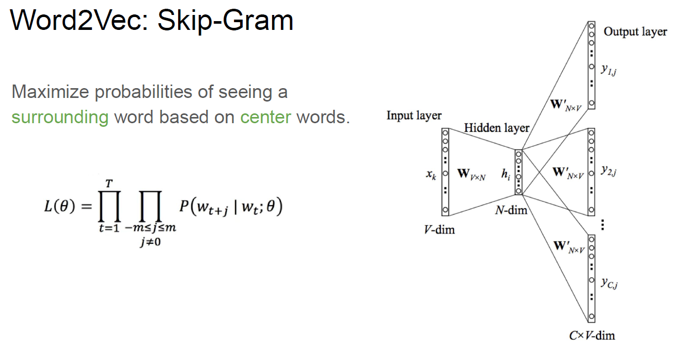
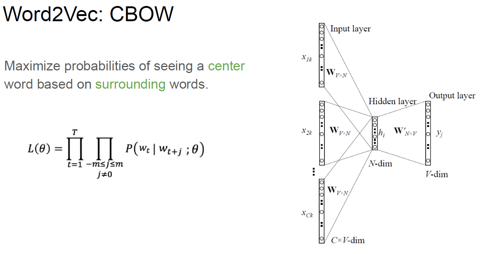
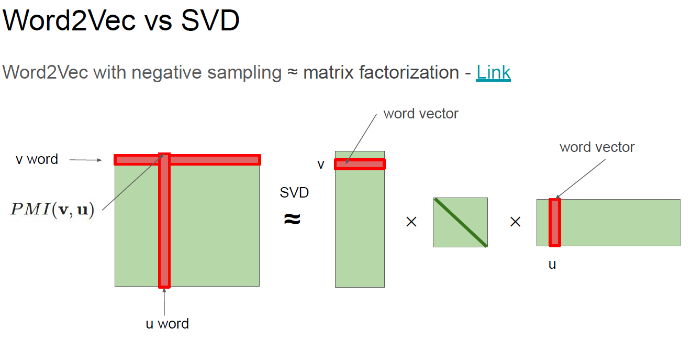
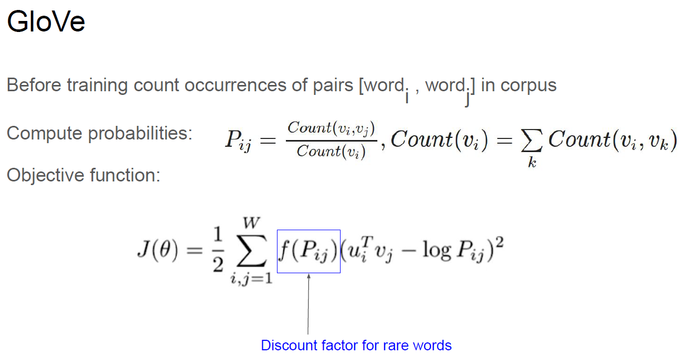
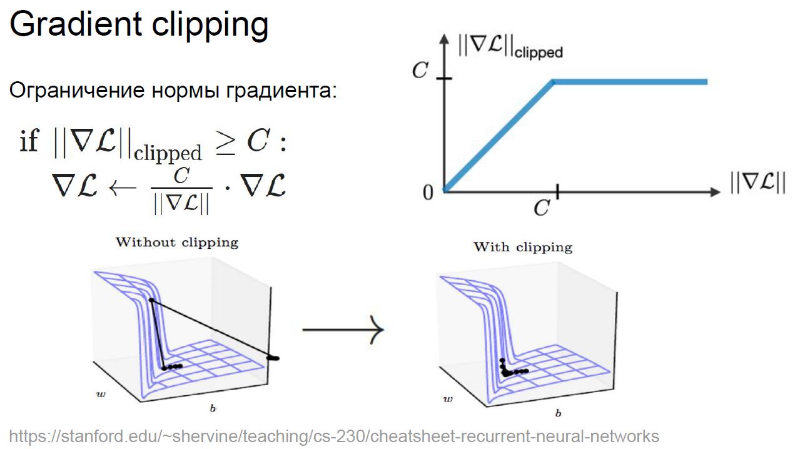
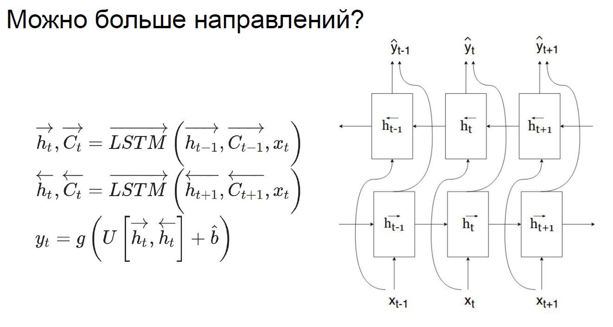
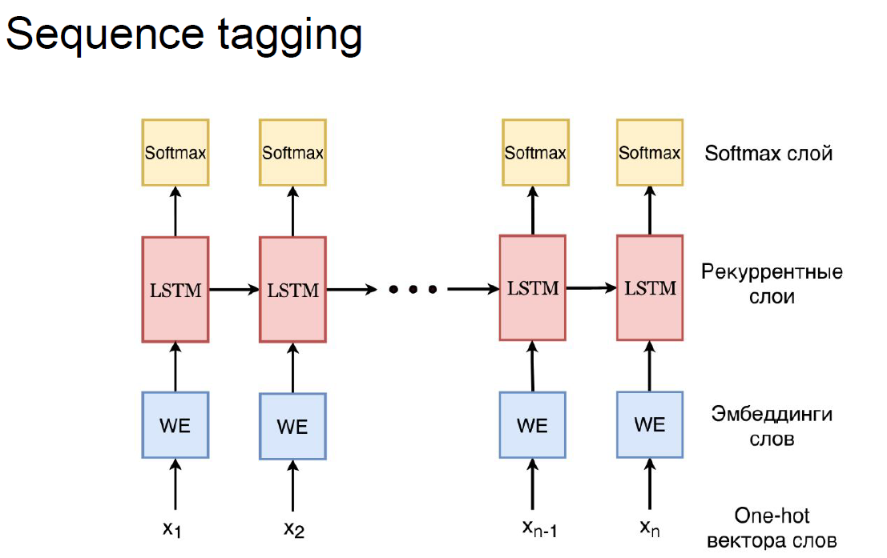
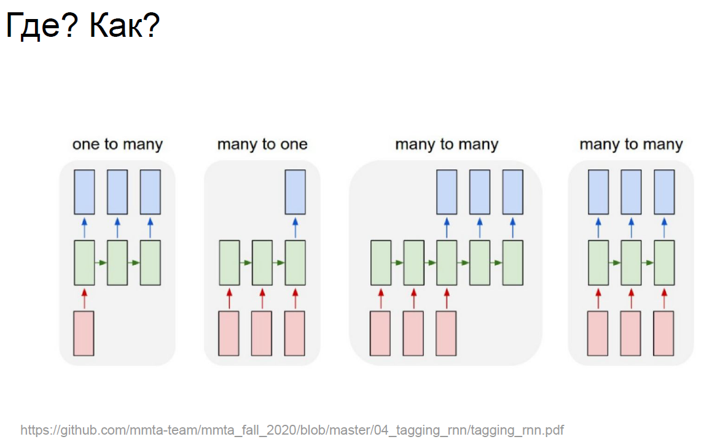

# Deep_Learning_School_part_2
Данный репозиторий является кратким, структурированным конспектом
изучаемого материала в процессе обучения в Deep Learning School

## Оглавление

- [Организационная информация](#Организационная-информация)
- [Введение в NLP и классификация текста](#Введение-в-NLP-и-классификация-текста)
  - [Homework: Simple Embeddings]()
- [Embeddings](#Embeddings)
  - [Homework: Embeddings]()
- [Рекуррентные нейронные сети](#Рекуррентные-нейронные-сети)
  - [Homework: Text Classification](#Homework:-Text-Classification)
  

## Организационная информация

## Введение в NLP и классификация текста
 
- [Введение_в_NLP.pdf](02_Введение_в_NLP_и_классификация_текста/Введение_в_NLP.pdf)
- [[seminar]text_preprocessing_and_classification.ipynb](02_Введение_в_NLP_и_классификация_текста/[seminar]text_preprocessing_and_classification.ipynb)
    - [nltk](https://www.nltk.org/)
    - [Gensim](https://radimrehurek.com/gensim/)
    - [Razdel](https://natasha.github.io/razdel/)
    - [natasha](https://natasha.github.io/)

- [Лекция. Введение в NLP.](https://www.youtube.com/watch?v=d0oV1MZ_KdE&ab_channel=DeepLearningSchool)
- [Семинар. Обработка текста.](https://www.youtube.com/watch?v=Aa-p8ddbxpQ)
- [Семинар. Решение задачи классификации текста](https://www.youtube.com/watch?v=ltyWeIPrAVA)

- Предобработка текста

- Выделение признаков

- Коллокация, NGramms

- Pointwise mutual information

- Context embeddings

- Уменьшение размерности данных

- Co-Occurrence Count + dimensional reduction

- PMI + dimensional reduction

- TF-IDF + dimensional reduction

## Embeddings

- [Embeddings.pdf](04_Embeddings/Embeddings.pdf)
- [word2vec.ipynb](04_Embeddings/word2vec.ipynb)

- [Лекция. Embeddings.](https://www.youtube.com/watch?v=eXQAOTsbhLQ)
- [Семинар. Word2Vec.](https://www.youtube.com/watch?v=iLzZO_4xyMg)

- Word2Vec(идея скользящего окна для подсчёта pmi, Co-Occurrence Count, etc.)

- Cross-Entropy(мера расхождения между двумя распределениями)

- Target function, log-likelihood для Word2Vec

- Схема работы Word2Vec

- 2 схемы работы Word2Vec(Skip-Gram, CBOW)

- Word2Vec + negative sampling ~ SVD

- Видоизменённая лосс-функция

## Рекуррентные нейронные сети

- [RNN.pdf](06_Рекуррентные_нейронные_сети/RNN.pdf)
- [seminar_cnn_and_rnn.ipynb](06_Рекуррентные_нейронные_сети/seminar_cnn_and_rnn.ipynb)
  - [библиотека Datasets от huggingface](https://huggingface.co/docs/datasets/)

- [Лекция. Embeddings.](https://www.youtube.com/watch?v=eXQAOTsbhLQ&ab_channel=DeepLearningSchool)
- [Семинар. Рекуррентные нейронные сети](https://www.youtube.com/watch?v=_wpAkWZmlyg&t=1474s&ab_channel=DeepLearningSchool)

### Homework: Text Classification
- [_[homework]classification.ipynb](07_hw_Text_Classification/_[homework]classification.ipynb)
- Вспомогательные источники:
  - Understanding BucketIterator, Field, LabelField, Glove
    - [Better Batches with PyTorchText BucketIterator](https://gmihaila.medium.com/better-batches-with-pytorchtext-bucketiterator-12804a545e2a)
    - [Sentiment Analysis with LSTM and TorchText with Code and Explanation](https://www.analyticsvidhya.com/blog/2021/09/sentiment-analysis-with-lstm-and-torchtext-with-code-and-explanation/)
  - Understanding Glove, Vectors and why do i need it
    - [Deep Learning For NLP with PyTorch and Torchtext](https://towardsdatascience.com/deep-learning-for-nlp-with-pytorch-and-torchtext-4f92d69052f)
  - Understanding Bidirectional
    - [Understanding Bidirectional RNN in PyTorch](https://towardsdatascience.com/understanding-bidirectional-rnn-in-pytorch-5bd25a5dd66)
  - CNN for text classifications
    - [practice02_CNN_for_texts.ipynb(семинар от Родослава Нейчева)](ml-mipt/week1_02_CNN_for_texts_and_more_embeddings/practice02_CNN_for_texts.ipynb)

- Более сложные структуры для рекуррентных нейронных сетей

