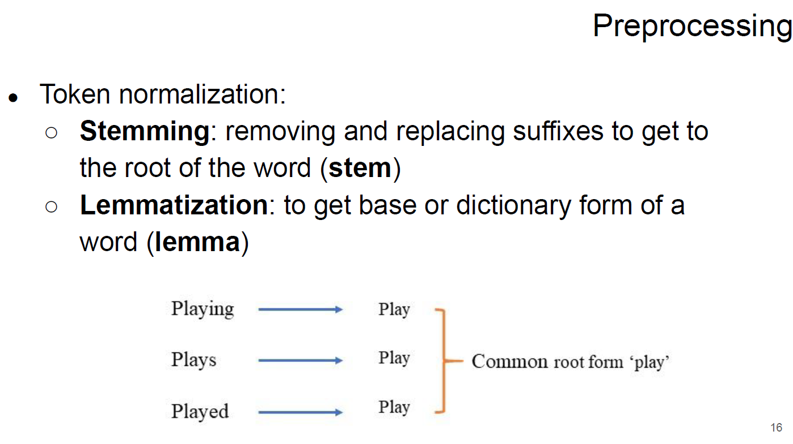
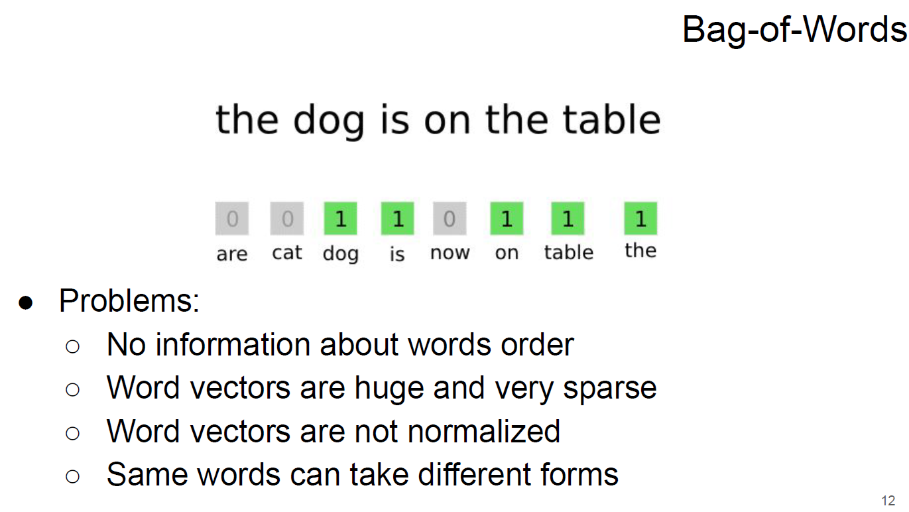
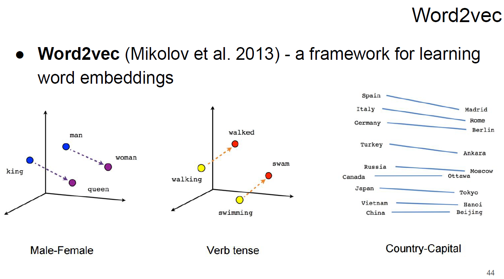

## Оглавление

- [Reccurent Neural Networks and Language Models](#Reccurent-Neural-Networks-and-Language-Models)
- [Прикладное машинное обучение 1. Intro to NLP. Word embeddings](#Intro-to-NLP-Word-embeddings)

- [ссылка на плейлист с лекциями(part_1)](https://www.youtube.com/playlist?list=PL4_hYwCyhAvZyW6qS58x4uElZgAkMVUvj)
- [сслыка на плейлист с семинарами(part_1)](https://www.youtube.com/playlist?list=PL4_hYwCyhAvYPOWn6e44RKxEfRWEsPA1z)

- [ссылка на плейлист с лекциями(part_2)](https://www.youtube.com/playlist?list=PL4_hYwCyhAvY7k32D65q3xJVo8X8dc3Ye)
- [сслыка на плейлист с семинарами(part_2)](https://www.youtube.com/playlist?list=PL4_hYwCyhAvZLp0CTIDVQr9FtDR_7DaUr)

## Reccurent Neural Networks and Language Models

- [ml-mipt_s20_lect010_Language_models_and_RNN.pdf](week0_10_RNN_and_Language_models/ml-mipt_s20_lect010_Language_models_and_RNN.pdf)
- [week0_10_Names_generation_from_scratch.ipynb](week0_10_RNN_and_Language_models/week0_10_Names_generation_from_scratch.ipynb)

- Рекурентный блок

- Структрура простой RNN

- Пример работы RNN

- Формулы получения скрытых состояний RNN для разных слоёв

- Пример генерации слов RNN

- Vanila RNN

- [LSTM](https://colah.github.io/posts/2015-08-Understanding-LSTMs/)

- [LSTM: quick overview](http://web.stanford.edu/class/cs224n/slides/cs224n-2019-lecture07-fancy-rnn.pdf)

- LSTM: формулы

- GRU

- GRU: формулы

## Intro to NLP Word embeddings

- [ml-mipt_f20_lect101_Word_embeddings.pdf](week1_01_word_embeddings/ml-mipt_f20_lect101_Word_embeddings.pdf)
- [week01_dealing_with_word_embeddings.ipynb](week1_01_word_embeddings/week01_dealing_with_word_embeddings.ipynb)

- Feature Extraction: classical approach
    - Bag-of-Words
    - Bag-ofNgramms
    - TF-IDF

- Preprocessing

- Bag-of-Words

- Bag-of-Words(NGramms)

- TF-IDF

- TF-IDF(example)

- Word representations via matrix factorization

- Word2vec

