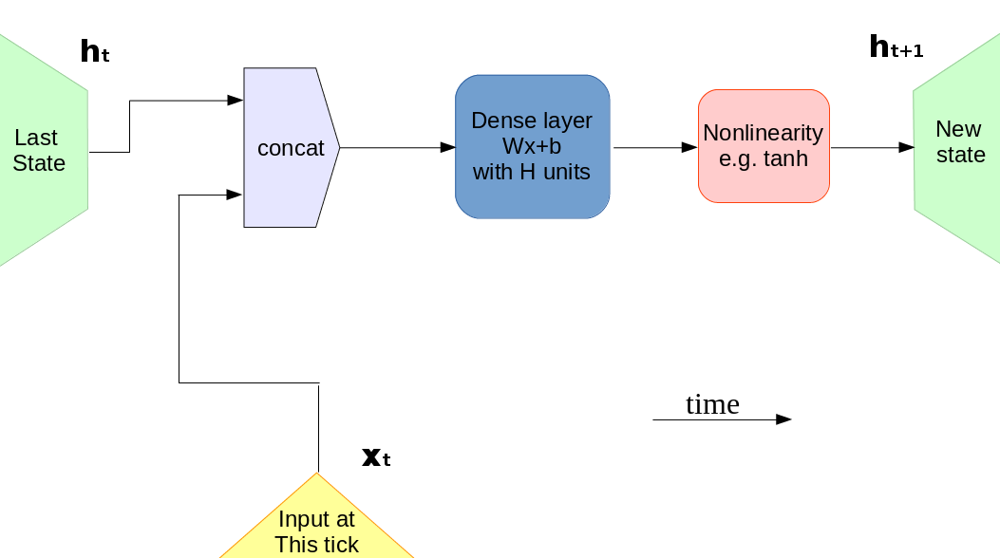
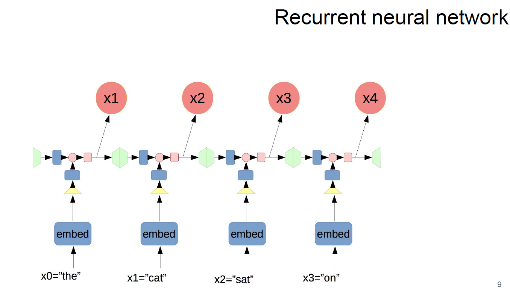
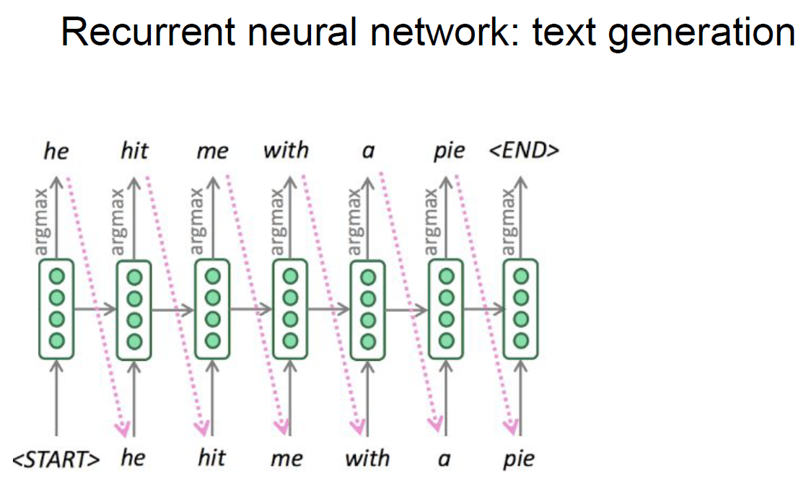
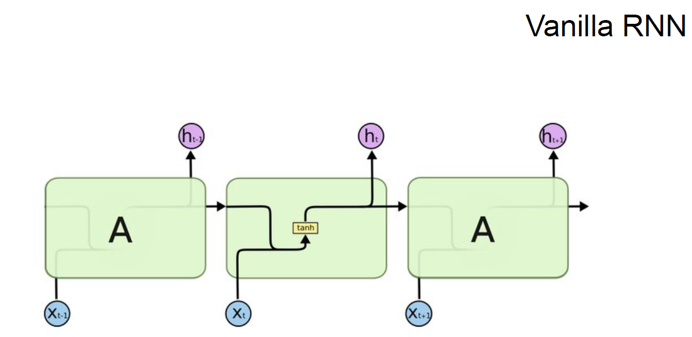

## Reccurent Neural Networks and Language Models

- [ml-mipt_s20_lect010_Language_models_and_RNN.pdf](ml-mipt_s20_lect010_Language_models_and_RNN.pdf)
- [week0_10_Names_generation_from_scratch.ipynb](week0_10_Names_generation_from_scratch.ipynb)

- Рекурентный блок
  
- Структрура простой RNN
  
- Пример работы RNN
  
- Формулы получения скрытых состояний RNN для разных слоёв
  
- Пример генерации слов RNN
  
- Vanila RNN
  
- [LSTM](https://colah.github.io/posts/2015-08-Understanding-LSTMs/)
  
- [LSTM: quick overview](http://web.stanford.edu/class/cs224n/slides/cs224n-2019-lecture07-fancy-rnn.pdf)
  
- LSTM: формулы
  
- GRU
  
- GRU: формулы
  
