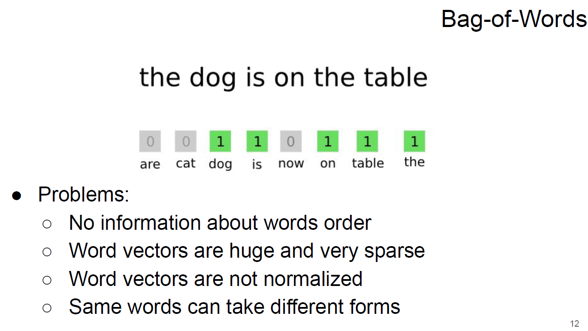
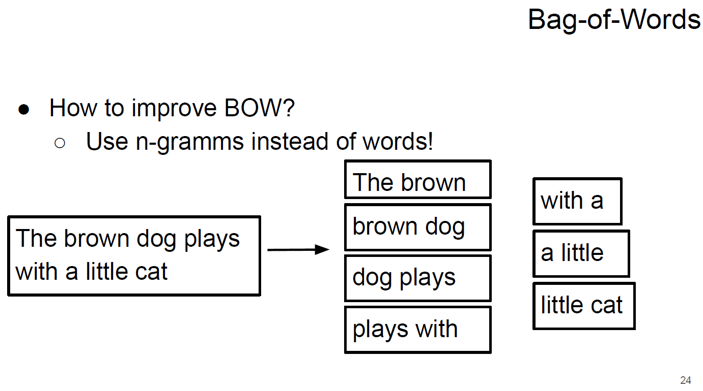
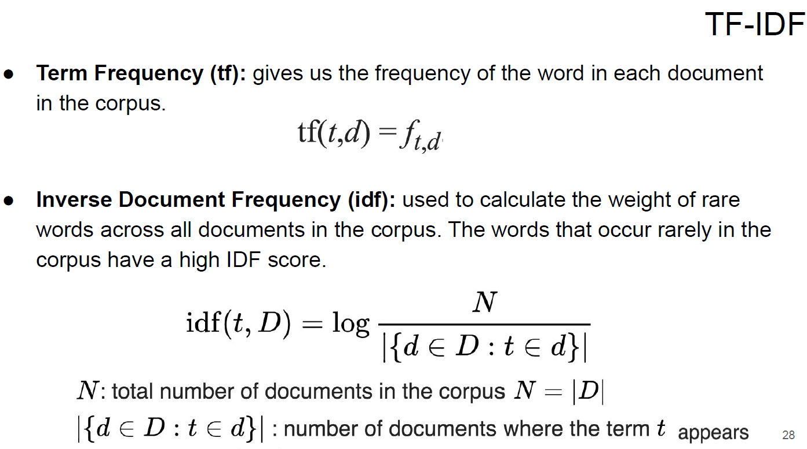
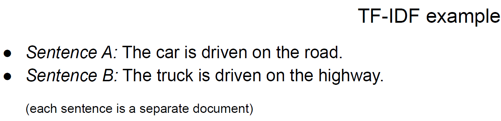
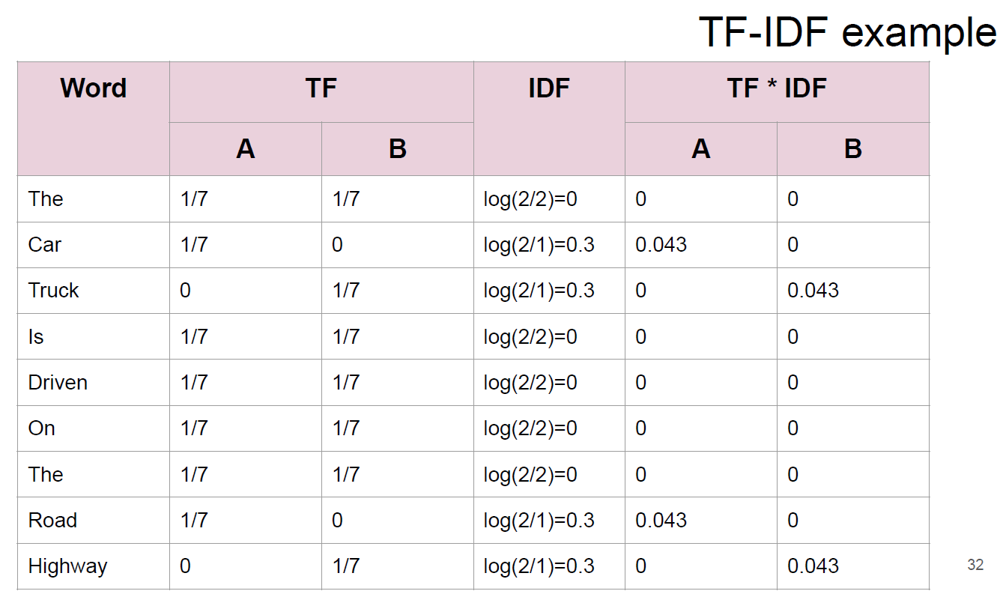
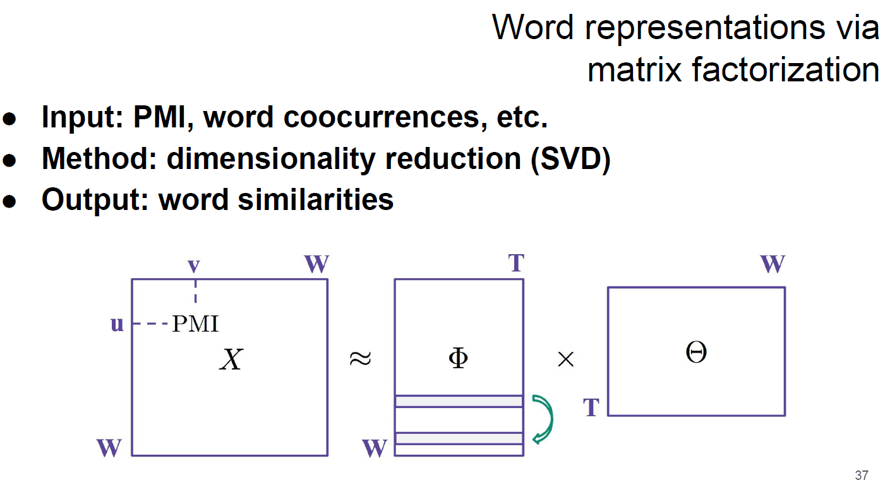
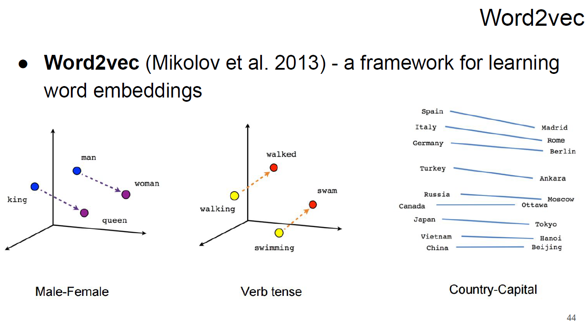

Visualizing and building embeddings:

Further readings:
1. Great resource by Lena Voita (direct link to Word Embeddings explanation): https://lena-voita.github.io/nlp_course/word_embeddings.html
2. Word2vec tutorial: http://mccormickml.com/2016/04/19/word2vec-tutorial-the-skip-gram-model/
3. Beautiful post by Jay Alammar: http://jalammar.github.io/illustrated-word2vec/

## Intro to NLP Word embeddings

- [ml-mipt_f20_lect101_Word_embeddings.pdf](ml-mipt_f20_lect101_Word_embeddings.pdf)
- [week01_dealing_with_word_embeddings.ipynb](week01_dealing_with_word_embeddings.ipynb)

- Feature Extraction: classical approach
    - Bag-of-Words
    - Bag-ofNgramms
    - TF-IDF

- Preprocessing
  
- Bag-of-Words
  
- Bag-of-Words(NGramms)
  
- TF-IDF
  
- TF-IDF(example)
  
  
- Word representations via matrix factorization
  
- Word2vec
  