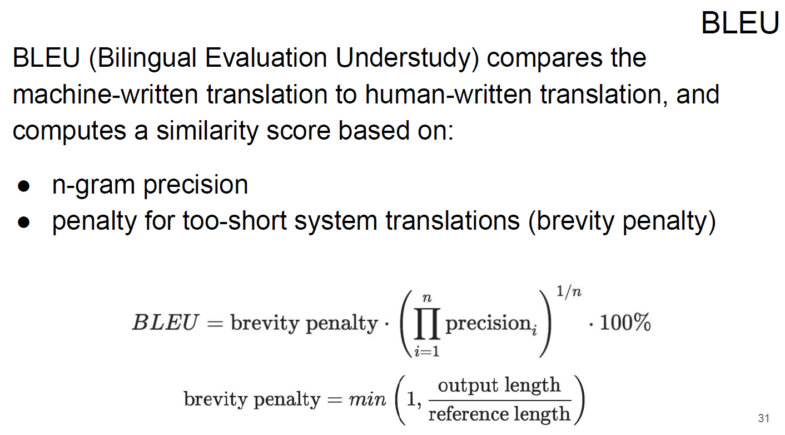

Neural Machine Translation as seq2sec:

Attention basics and Tensorboard example:

Further readings:

* Great blog post by Jay Alammar: https://jalammar.github.io/illustrated-transformer/
* Notebook on positional encoding: [link](https://github.com/ml-mipt/ml-mipt/blob/advanced/week04_Transformer/week04_positional_encoding_carriers.ipynb)
* Great Annotated Transformer article with code and comments by Harvard NLP group: https://nlp.seas.harvard.edu/2018/04/03/attention.html

## Machine Translation and Attention

- [ml-mipt_f20_lect103_Machine_Tranlation.pdf](../week1_03_Machine_Translation_and_Attention/ml-mipt_f20_lect103_Machine_Tranlation.pdf)
- [practice_seq2seq_NMT.ipynb](../week1_03_Machine_Translation_and_Attention/practice_seq2seq_NMT.ipynb)
- [extra_practice_Attention_basics_and_tensorboard.ipynb](../week1_03_Machine_Translation_and_Attention/extra_practice_Attention_basics_and_tensorboard.ipynb)

- Архитектура Seq2Seq(Encoder + Decoder)

- Beam search

- Метрика качества машинного перевода

- Attention

- Варианты реализации Attention

